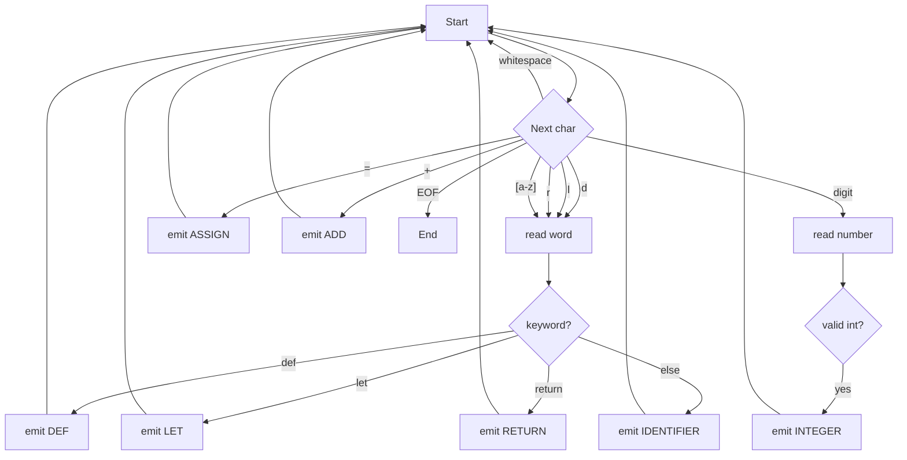

The other day, I decided to write a lexer by hand, in C, with no external tools.
This is all good and well, until it comes to keyword recognition, which isn't
a difficult problem, it's just a place where the efficient solution takes a lot
of code, and really, really should be generated by an external tool.

## Lexing

Lexing is the task of breaking a string up into lexemes.
Here's an example of lexing the C programming langauge:

```
     id  int     com    sta id   obr     int  cbr
    |--| |-|      |      | |---|  |        |  |
int main(int charc, char **charv) { return 0; }
|-|     |    |---|  |--|  |     |   |----|  |
int     opa   id     cha  sta   cpa  ret   sem
```

Here, I've labelled each lexeme. Here's the key:

* `int`: int
* `id`: identifier
* `com`: comma
* `char`: char
* `sta`: star / asterisk (*)
* `obr`: open brace (`{`)
* `cbr`: close brace (`}`)
* `int`: integer literal
* `opa`: open parenthesis (`(`)
* `cpa`: close parenthesis (`)`)
* `ret`: return keyword
* `sem`: semicolon

## DFAs

A DFA is a [Deterministic Finite Automaton](https://en.wikipedia.org/wiki/Deterministic_finite_automaton).
Which is, in the case of our domain:
* A set of states
* A set of transitions between states
  * Each consuming a character
  * Each with a unique (originating state, character) tuple
* A start state
* A set of final states
  * Each annotated with lexeme family

## DFAs as lexers

Let's write a DFA which lexes a functional language.

This language has the following lexemes, defined as regex:

* def: `def`
* let: `let`
* return: `return`
* identifier: `[a-z]+`
* integer: `0|[1-9][0-9]*`
* assign: `=`
* add: `+`


